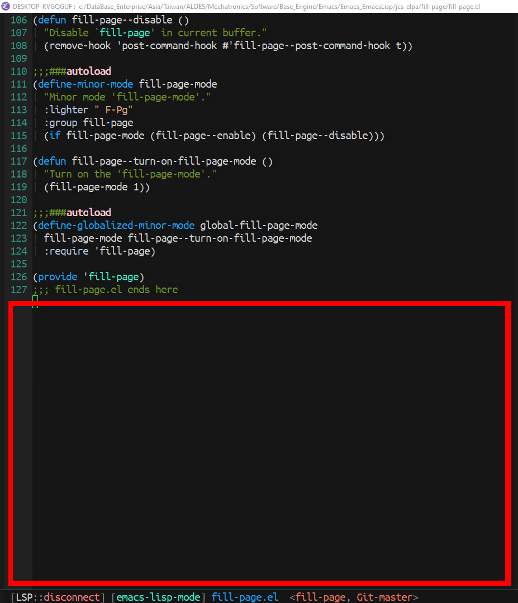
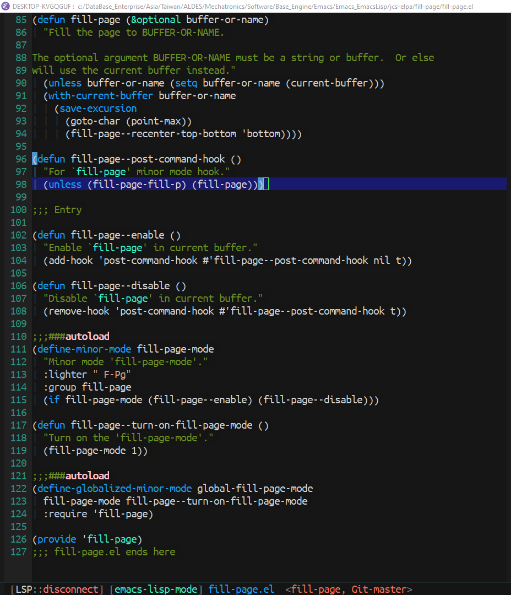

[](https://www.gnu.org/licenses/gpl-3.0)
[](https://melpa.org/#/fill-page)
[](https://stable.melpa.org/#/fill-page)

# fill-page
> Fill buffer so you don't see empty lines at the end.

[](https://github.com/jcs-elpa/fill-page/actions/workflows/test.yml)

Minor mode that scrolls the buffer to the bottom of window so you don't
see the waste of empty space at the end of the buffer.

| Before                       | After                       |
|:----------------------------:|:---------------------------:|
| | |

## Usage

You can enable this package by doing the following command.

```
M-x fill-page-mode
```

Or call it globally to take effect to all buffer.

```
M-x global-fill-page-mode
```

## Contribute

[](http://makeapullrequest.com)
[](https://github.com/bbatsov/emacs-lisp-style-guide)
[](https://www.paypal.me/jcs090218)

If you would like to contribute to this project, you may either
clone and make pull requests to this repository. Or you can
clone the project and establish your own branch of this tool.
Any methods are welcome!
